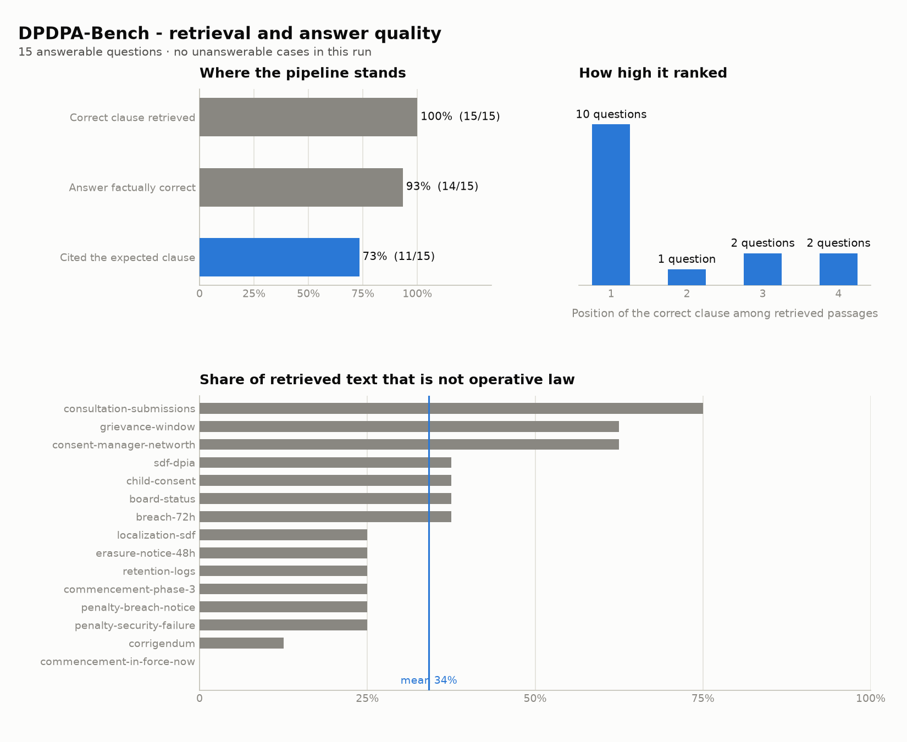

# DPDPA-Bench

**First open benchmark and evaluation harness for faithful RAG over Indian data-protection law — answers grounded in the DPDP Act with clause-level citations, scored for retrieval accuracy, citation correctness and abstention. A compliance checker that maps a plain-English business description onto applicable obligations is the next milestone.**

- **Domain:** Gen AI / NLP / Legal Tech / Data Governance
- **Developer:** Independent project, built and maintained solo after graduating
- **Compute:** Google Colab / Kaggle free tier sufficient
- **Status:** Working pipeline, with baseline results below. The demo at [dpdp.hari-pi.com](https://dpdp.hari-pi.com) is hosted on a self-hosted server and is not always reachable.

---

## Current results

Baseline over the answerable question set in `benchmark_results.json`:



| Metric | Result |
| --- | --- |
| Correct clause retrieved | 100% (15/15) |
| Answer factually correct | 93% (14/15) |
| Cited the expected clause | 73% (11/15) |
| Ungrounded citations | 1 |
| Non-operative share of retrieved text | 34% mean |

Retrieval is not the bottleneck. The expected clause is retrieved for every
question and ranks first for 10 of the 15. The gap is citation discipline: the
answer is usually right, but roughly a quarter of the time it does not cite the
clause the answer rests on.

Context quality looks like the lever. The four questions that missed the expected
citation carry a mean 50% non-operative share, against 28% for the eleven that
cited correctly — draft rules, FAQs and consultation summaries crowding out the
operative provisions. Biasing retrieval toward operative law is the next thing
to try.

The one factual miss (`commencement-in-force-now`) does not fit that pattern: its
retrieved context was 0% non-operative, so it needs a separate look.

Abstention is unmeasured here. Three unanswerable cases are authored in
`scripts/benchmark.py` (`neg-gdpr-out-of-scope`, `neg-nonexistent-section`,
`neg-no-enforcement-data`) but are not part of this committed run.

### Regenerating

```sh
pip install -r requirements-charts.txt
python scripts/benchmark.py       # writes benchmark_results.json
python scripts/report_charts.py   # writes docs/benchmark.png
```

`benchmark.py` re-runs every case from scratch unless `--resume` is passed, so a
code change is never scored against stale output.

---

## 1. Problem

India's Digital Personal Data Protection Act (DPDPA 2023) is now the operative privacy law, and startups/SMEs must comply with it. Generic LLMs hallucinate on legal text — they invent section numbers, misstate obligations, and mix up GDPR with DPDPA. Any compliance assistant must answer with **verifiable, clause-level grounding** and must **abstain when it doesn't know**.

The practical gap founders actually face: they don't ask "what does Section 6 say?" — they ask **"I'm building X, am I breaking any DPDPA rules?"** (e.g., *"We scrape public profiles and sell the data to recruiters"*). There is no tool that maps a plain-English business description onto specific DPDPA obligations/violations with citations. Legal consultation is expensive; generic chatbots guess. This project builds both the benchmark that makes such a system measurable and a working compliance-checker demo on top of it.

## 2. Research gap

- RAG evaluation is a hot 2025/26 research area (RAGAS, hallucination-detection benchmarks), **but no public benchmark exists for Indian privacy law**.
- Existing legal-QA benchmarks focus on US/EU law (EU AI Act, GDPR, case law). DPDPA is untouched.
- Existing RAG eval metrics emphasize answer relevance; legal QA additionally needs **citation accuracy** and **abstention quality** — no standard harness measures these together.
- Whoever publishes the first benchmark + harness becomes the reference point future papers cite.

## 3. The contribution (the real deliverable)

The paper is the vehicle; the **artifacts** are the contribution. Each is marked
with where it actually stands today:

1. **Clause-tagged DPDPA corpus** — *partly built.* The Act and the 2025 Rules are
   ingested from 12 tracked sources and chunked into citable units (`s. 8`,
   `r. 6`), which is what makes clause-level citation and scoring possible. The
   richer per-clause metadata (obligation type, actor, data-principal rights,
   penalties) and the optional DPDPA↔GDPR concept mapping are **not built**.
2. **Gold QA benchmark (~150–300 questions)** — *partly built.* 21 cases are
   authored and verified by hand, covering:
   - **Factual** ("What is verifiable consent under Section 6?") — present
   - **Obligation** ("Must a fiduciary appoint a DPO?") — present
   - **Unanswerable/adversarial** (to test abstention) — three authored
   - **Comparative** (DPDPA vs GDPR obligations) — not yet authored
   - **Scenario/compliance**: a business-model description ("EdTech app tracking
     children without parental consent") → applicable clauses / violations / "not
     determinable from the act" — not yet authored
3. **Compliance-checker application** — *not built.* The intended design: the user
   describes their business model in plain English; the pipeline extracts
   data-flow facts (what personal data, whose, purpose, consent, sharing,
   retention, cross-border), maps clauses to each fact, reports **compliant /
   potential violation / not covered by the act** with the exact citation,
   abstains when the description is too thin or falls outside DPDPA's scope, and
   ships behind a **"research prototype, not legal advice"** disclaimer. Today the
   service exposes question answering only (`/ask`).
4. **Open-source evaluation harness** — *built,* for the question-answering path:
   - Fact coverage (is the answer supported by the corpus?)
   - Citation accuracy (does it cite the clause the answer rests on?)
   - Ungrounded citations (clauses cited that do not support the claim)
   - Abstention quality (correct refusal on unanswerable questions)
   - Context noise (share of retrieved passages that are not operative law)

   **Not built:** violation-detection metrics (they need artifact 3) and the
   standard RAGAS metrics.
5. **Baseline results table** — *partly built.* One configuration is scored over 15
   questions and charted under [Current results](#current-results). The full sweep
   — BM25 vs dense vs hybrid × several LLMs, on both the QA set and the scenario
   set — has not been run.

## 4. Data sources (all public)

- DPDPA 2023 full text — India Code / MeitY / official gazette
- DPDPA Rules draft (2025) — MeitY public consultation documents
- GDPR text (for cross-law transfer experiments) — EUR-Lex
- Synthetic QA generation via LLM, hand-verified

## 5. Paper shape

**Working title:** *"DPDPA-Bench: A Benchmark and Evaluation Harness for Faithful Legal Question Answering and Compliance Checking on India's Digital Personal Data Protection Act"*

The corpus, the harness and a first baseline exist. Before a submission is
honest, it still needs:

- the gold set grown from the 21 authored cases toward the 150-300 target
- abstention actually measured, not just authored
- a comparison across retrievers and LLMs instead of one configuration
- the compliance-checker path built and scored, since that is the part no
  existing benchmark covers

Candidate venues:

- FIRE (Forum for Information Retrieval Evaluation) - India-based, IR and
  benchmark focus
- IEEE: CONECCT, ICCCNT, Pune Section conferences
- Springer LNCS proceedings
- MDPI / Frontiers AI journals for an extended version

## 6. Risks & mitigations

| Risk | Mitigation |
|------|-----------|
| Annotation quality of gold QA pairs | LLM-draft → 2-person independent verify → adjudication; track inter-annotator agreement |
| Legal accuracy of answers & violation verdicts | Restrict claims to what's in the corpus; require exact clause citation for every flagged violation; disclaimer that it's a research benchmark/prototype, not legal advice |
| False positives in compliance checker eroding trust | Report precision/recall per clause in baselines; "potential violation" phrasing instead of definitive verdicts; abstain on vague scenarios |
| Liability perception of a "violation checker" | Frame as educational gap-analysis demo; never output fines/penalty amounts as advice; terms of use |
| Scope creep (whole Indian legal system) | Strictly DPDPA 2023 + draft rules only; anything outside → abstain |
| API costs for LLM baselines | Prefer open models (Llama 3.1 8B via Ollama, Gemma) + free tiers |

## 7. Roadmap

Built:

1. **Corpus and ingestion** - the Act, the 2025 Rules, the draft rules, official
   FAQs and parliamentary Q&A, tracked in `data/sources_manifest.json`
2. **Hybrid retrieval** - BM25 and dense scoring fused by a rank-based rerank
   (`dpdp_rag/query.py`)
3. **Answering service** - `/ask` behind authentication, with a durable job queue
   and a coordinator/worker split so notebook compute stays outbound-only
4. **Evaluation harness** - retrieval hit and rank, context noise, fact coverage,
   expected-citation and ungrounded-citation checks, and abstention scoring
5. **Baseline and report** - 15 answerable questions scored and charted, under
   [Current results](#current-results)

Next:

6. Run the six authored cases missing from the committed results, including all
   three unanswerable ones, so abstention stops being a gap
7. Grow the gold set from 21 cases toward the 150-300 target
8. Build the compliance-checker path - a plain-English business description in,
   applicable obligations out. Only `/ask` exists today
9. Baseline across retrievers and LLMs rather than a single configuration
10. Failure taxonomy and write-up

## Private Colab worker

The public UI and durable queue live at [dpdp.hari-pi.com](https://dpdp.hari-pi.com). Colab only supplies outbound LLM/RAG compute, so it does not need ngrok, an inbound port, or a stable Colab URL. If Colab disconnects, the site stays online and queued work waits for the next worker.

One-time setup:

1. Create a GitHub personal access token with read access to this private repository.
2. In Colab, open the Secrets panel (key icon), add `GITHUB_TOKEN`, and enable notebook access. This is only required because the repository is private.

After that, open [`colab_worker.ipynb`](colab_worker.ipynb) (or the compatibility notebook [`colab_dpdp.ipynb`](colab_dpdp.ipynb)) from GitHub in Colab and choose **Runtime → Run all**. Each now contains the same single worker cell: it securely clones or refreshes the private repository, installs dependencies, starts Ollama, prepares the corpus/index, and connects the worker to `dpdp.hari-pi.com`. Neither notebook uses ngrok.

If the repository is already cloned in a Colab runtime, the equivalent command is simply:

```bash
bash scripts/start_colab_worker.sh
```

The worker credential is bundled in this private repository, so it requires no additional setup. Leave the cell running while you want GPU-backed answers; stopping or resetting Colab safely disconnects the worker and returns an in-progress job to the durable queue. Public access remains separately protected by the login on `dpdp.hari-pi.com`.

## Preferred PC worker with Colab fallback

From macOS or Linux, start the PC worker with:

```bash
bash scripts/start_pc_worker.sh
```

On Windows, use:

```powershell
powershell -ExecutionPolicy Bypass -File .\start.ps1
```

This root launcher pulls the latest compatible code, verifies the coordinator
and embedded worker credential, prepares Ollama/index data, and stays open with
one `CONNECTED` line per registered PC worker slot. The website refreshes worker
availability every five seconds. It also prints the coordinator's PC/Colab and
queue counts every ten seconds and saves the complete console transcript under
`logs/pc-worker-YYYYMMDD-HHMMSS.log` for troubleshooting.

The coordinator always gives new requests to the PC while it is connected. If
the PC disconnects or cannot answer a request, that request is automatically
returned to the queue for a connected Colab worker. The browser always uses the
same `dpdp.hari-pi.com` URL.

At startup the Linux/macOS launcher detects available NVIDIA VRAM or Apple
unified memory and selects a safe worker/Ollama parallelism profile. A 12–20 GB
GPU (including a Colab T4) uses two concurrent requests by default. Larger GPUs
use three or four. Override detection with `DPDP_WORKER_CONCURRENCY` and
`DPDP_NUM_CTX`. Ollama keeps both models loaded, and dense retrieval vectors are
cached on CUDA or Metal after their first use; HTTP/JSON, BM25, and initial
loading remain CPU/disk operations.

## 8. Validating references (collected 2026-08-25)

- RAGAS: Automated Evaluation of RAG — arXiv:2309.15217
- Real-Time Evaluation Models for RAG (hallucination detection benchmark) — arXiv:2503.21157
- MEGA-RAG (public-health RAG w/ hallucination mitigation) — Frontiers in Public Health, 2025
- Evaluating RAG Variants for Clinical QA — MDPI Electronics 14(21):4227, 2025
- Hallucination Mitigation for RAG-based LLMs: A Review — MDPI Mathematics 13(5):856, 2025
## Persistent worker cache

After the PC worker has successfully ingested the corpus once, publish its
vector index and Ollama model store to Droidian from PowerShell:

```powershell
.\scripts\publish_cache.ps1
```

The script copies only the small vector index into the coordinator's read-only
artifact volume. Ollama downloads model weights directly in Colab by default;
use `-IncludeModels` only if you explicitly want to transfer the large model
store to Droidian.
On the next Colab startup, `scripts/start_colab_worker.sh` downloads and
verifies the cache before Ollama starts. A valid `chroma_db` cache skips the
expensive fetch/extract/ingest stages; if the cache is missing or invalid,
startup falls back to the normal setup automatically.
